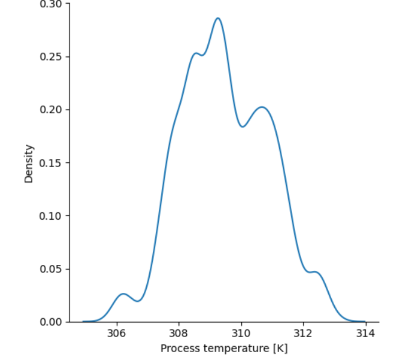
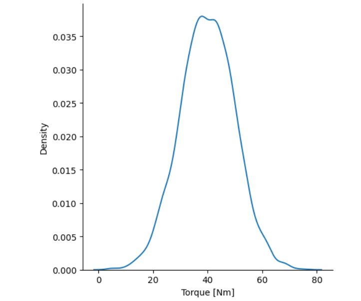
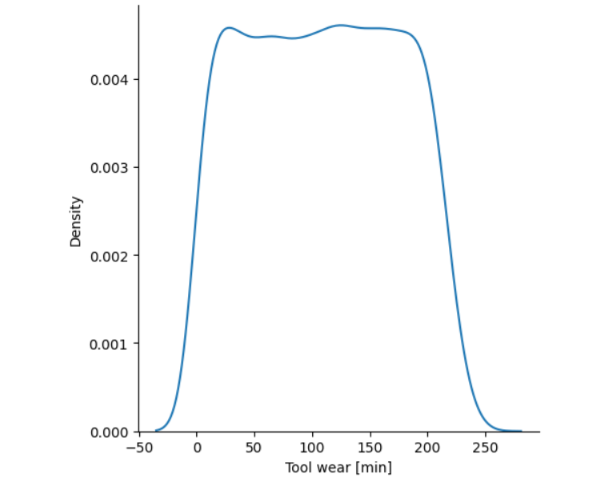
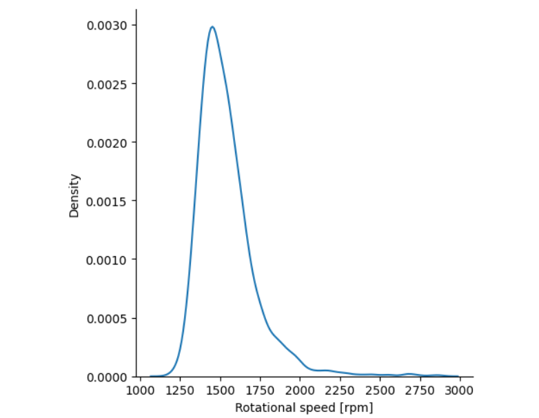
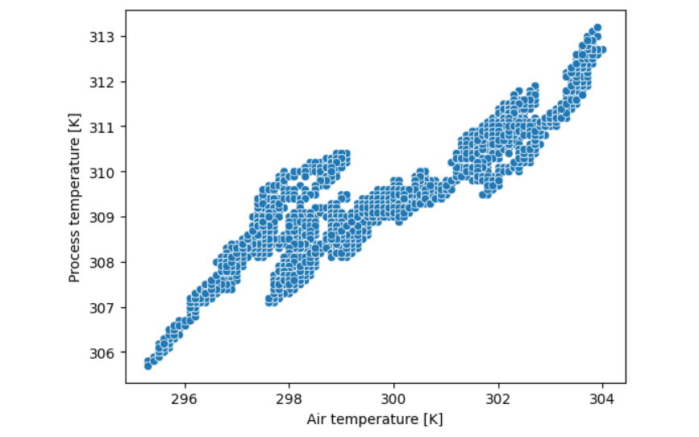
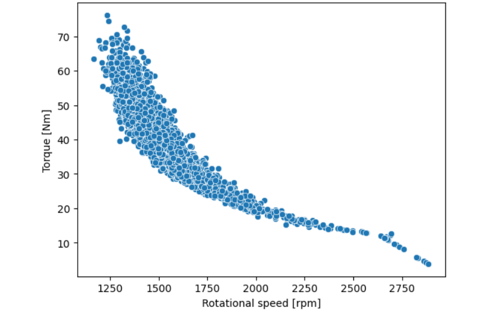

# **Sensor Failure Detection Model**

**This repository contains an end to end machine learningpipeline built to predict industrial machine failures based on continuous sensor telemetry.**

**Exploratory Data Analysis**
   After performing comprehensive Univariate, Bivariate and Multivariate analysis, several critical operational and structural characteristics were uncovered:
   
   **Univariate Data Analysis**
   
   **Air Temperature:-** Symmetric, Bimodal,Two primary operation zones [peaked at 298K and 302K], High overall variance.

   
   
   **Process Temperature:-** Almost symmetric ( with a slight [right skew]) , Mutimodal [with prominent peaks around 309K and 310.5K], High overall variance.
   
   

   **Torque[Nm]:-** Symmetric,Unimodal(Bell Shaped), Moderate variance and  centered around ~40 Nm across a broad operational range (~0 to 80 Nm).

   

   **Tool Wear(min):-** Symmetric,Uniformly distributed (flat plateau across ~0 to 240 min), showing an even spread of tool age throughout the dataset.

   

   **Rotational Speed(rpm):-** Unimodal , Right skewed distribution with a prominent peak around ~1500 rpm; most operational data stays tightly clustered (low variance    baseline) with a long tail extending toward 2800+ rpm.

   

   **Bivariate Data Analysis**

   **Air Temperature VS Process Temperature:-** Strong Positive Linear Correlation (~0.85+ Pearson correlation). The overall trend shows a direct proportional             relationship with noticeable clustered operational bands/steps.

   

   **Rotational Speed VS Torque:-** Strong Negative Non-Linear (Curvilinear / Inverse) Relationship ($\sim -0.87$ Pearson correlation). Reflects underlying mechanical     power constraints ($\text{Power} \propto \text{Torque} \times \text{RPM}$).

   

   **Machine Type Variant VS Operating Sensors (`sns.barplot`):-** Across Low (L), Medium (M), and High (H) quality variants, baseline mean values for Torque (~40 Nm),    Rotational Speed (~1530 rpm), and Tool Wear remain constant. This confirms that higher failure rates in Type 'L' machines stem from lower structural tolerance          limits rather than harsher operational usage.
