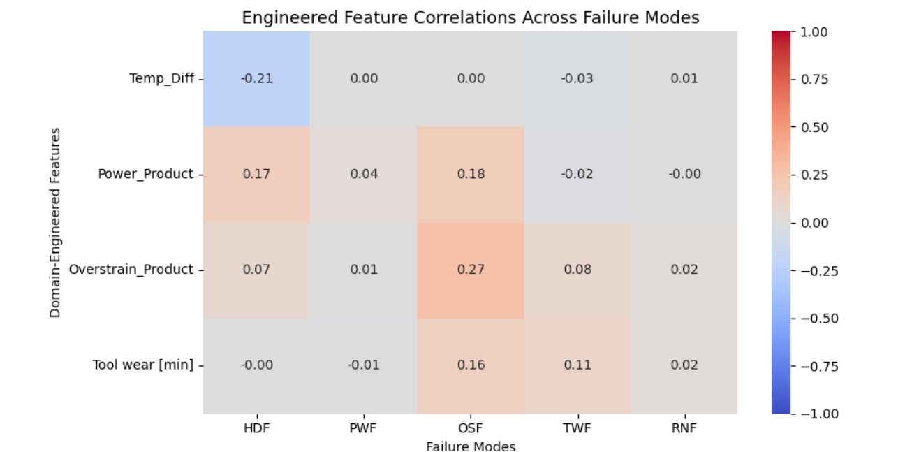

# **Sensor Failure Detection Model**

**This repository contains an end to end machine learningpipeline built to predict industrial machine failures based on continuous sensor telemetry.**

**Exploratory Data Analysis**                                                                                                                                              After performing comprehensive Univariate, Bivariate and Multivariate analysis, several critical operational and structural characteristics were uncovered:
   
   **Univariate Data Analysis**
   
   **Air Temperature:-** Symmetric, Bimodal,Two primary operation zones [peaked at 298K and 302K], High overall variance.

   
   
   **Process Temperature:-** Almost symmetric ( with a slight [right skew]) , Mutimodal [with prominent peaks around 309K and 310.5K], High overall variance.
   
   

   **Torque[Nm]:-** Symmetric,Unimodal(Bell Shaped), Moderate variance and  centered around ~40 Nm across a broad operational range (~0 to 80 Nm).

   

   **Tool Wear(min):-** Symmetric,Uniformly distributed (flat plateau across ~0 to 240 min), showing an even spread of tool age throughout the dataset.

   

   **Rotational Speed(rpm):-** Unimodal , Right skewed distribution with a prominent peak around ~1500 rpm; most operational data stays tightly clustered (low variance    baseline) with a long tail extending toward 2800+ rpm.

   

   **Bivariate Data Analysis**

   **Air Temperature VS Process Temperature:-** Strong Positive Linear Correlation (~0.85+ Pearson correlation). The overall trend shows a direct proportional             relationship with noticeable clustered operational bands/steps.

   

   **Rotational Speed VS Torque:-** Strong Negative Non-Linear (Curvilinear / Inverse) Relationship ($\sim -0.87$ Pearson correlation). Reflects underlying mechanical     power constraints ($\text{Power} \propto \text{Torque} \times \text{RPM}$).

   

   **Machine Type Variant VS Operating Sensors (`sns.barplot`):-** Across Low (L), Medium (M), and High (H) quality variants, baseline mean values for Torque (~40 Nm),    Rotational Speed (~1530 rpm), and Tool Wear remain constant. This confirms that higher failure rates in Type 'L' machines stem from lower structural tolerance          limits rather than harsher operational usage.

   | Failure Mode | Key Feature | Non-Failure (`0`) Profile | Failure (`1`) Profile | Technical Takeaway |
   | :--- | :--- | :--- | :--- | :--- |
   | **TWF** (Tool Wear) | Tool Wear [min] | Symmetric, centered at low wear | Right-skewed, concentrated at high wear | Failures occur predominantly on aged              components (>200 min). |
   | **PWF** (Power) | Torque [Nm] | Symmetric, normal baseline operating range | Strongly left-skewed at peak high torque | High torque overloads the electrical/         mechanical power boundary. |
   | **HDF** (Heat Dissipation) | Process Temp [K] | Slightly right-skewed at lower operational temp | Elevated right-skewed profile at high temp | Overheating            significantly reduces thermal dissipation capabilities. |

   Cross-tabulation analysis (`pd.crosstab`) reveals that individual failure modes are largely independent of machine quality variants (`L`, `M`, `H`), though failure     rates show minor concentrations in lower-tier models.
   

   **Multivariate Analysis**

   
   **Pearson Correlation Matrix:-** From the Pearson correlation heatmap, it can be inferred that air and process temperatures have a strong positive linear               relationship, whereas torque and rotational speed have a strong negative linear correlation. Additionally, failure modes like HDF and PWF show moderate                 positive linear correlations with machine failure. However, from the sensor vs. failure mode heatmap, no significant linear correlation is observed  between raw        sensor readings and individual failure types.

   **Pair Plot Insights**  
   
   **TWF (Tool Wear Failure):** Tool Wear Failure is primarily time- and wear-accumulative ($>200\text{ min}$). It is driven by mechanical wear rather than                instantaneous torque spikes.

   **OSF (Overstrain Failure):** Overstrain is a multi-variable failure. It occurs when a heavily worn component experiences high mechanical force ($\text{Tool Wear}      \times   \text{Torque}$). Because torque and rotational speed are inversely proportional, low RPM zones correspond to peak torque risk.

   **PWF (Power Failure):** Power Failure is dictated by the continuous power product ($\text{Power} \propto \text{Torque} \times \text{RPM}$). Failures are triggered     when operation breaches upper power limits ($>9000\text{ W}$) or drops below minimum thresholds ($<3500\text{ W}$), rather than single-sensor extremes.

   **Dedicated Scatter Plot Analysis (HDF):**
   **HDF (Heat Dissipation Failure):** A focused scatter plot of `Process temperature` vs. `Air temperature` isolates thermal failure points. HDF triggers almost          exclusively when the temperature differential ($\Delta T = T_{\text{process}} - T_{\text{air}}$) falls below critical dissipation limits under elevated ambient         temperatures.

**Feature Engineering**

   **Feature Construction**

   **Engineered Feature Correlations Across Failure Modes Heatmap** 
   Correlation Analysis: Pearson correlation revealed low linear dependency across failure modes ($r < 0.3$), indicating that machine breakdowns follow non-linear,        threshold-driven mechanics rather than linear trends.
   Model Selection Justification: This lack of linear correlation confirms that standard linear classifiers are insufficient and strongly justifies deploying non-         linear, tree-based models (e.g., Random Forest, XGBoost).

   

  
   ###  Data Preprocessing & Feature Engineering Pipeline

   To prevent data leakage, all feature transformations are encapsulated into a scikit-learn `Pipeline` and `ColumnTransformer` fitted exclusively on training data.

   #### 1. Data Splitting
   * **Stratified 70/30 Split** Applied `train_test_split(stratify=Y)` to preserve the severe class imbalance (~4.6% failure rate) consistently across training              (`x_train`) and testing (`x_test`) sets.

   #### 2. Custom Outlier Management
   * **`IQROutlierClipper`:** Built a custom scikit-learn transformer (`BaseEstimator`, `TransformerMixin`) that computes feature lower/upper bounds ($Q_1 - 1.5 \times      \text{IQR}$, $Q_3 + 1.5 \times \text{IQR}$) during `.fit()` and caps extreme values during `.transform()`.

   #### 3. Dual-Branch Feature Transformations
   Features are split and processed through dedicated sub-pipelines before merging:
   * **Numeric Sub-pipeline** (`KNNImputer` $\rightarrow$ `IQROutlierClipper` $\rightarrow$ `StandardScaler`)
   * **Features:** Raw sensor readings (`Air temperature`, `Process temperature`, `Rotational speed`, `Torque`, `Tool wear`) and domain-engineered features                (`Temperature_Difference`, `Power_Product`, `Overstrain_Product`).
   * **Processing:** Imputes missing values using 5 nearest neighbors, caps extreme outliers, and standardizes features to zero mean and unit variance.
   * **Ordinal Sub-pipeline** (`OrdinalEncoder`)
   * **Features:** Machine product type (`Type`).
   * **Processing:** Maps quality variants directly into ordered ranks (`L` $\rightarrow$ 0, `M` $\rightarrow$ 1, `H` $\rightarrow$ 2).

   #### 4. Dimensionality Reduction
   * **PCA (`n_components=0.90`):** Automatically selects the minimum number of principal components required to retain at least 90% of total feature variance across      preprocessed features.

 ## Model Evaluation & Comparison
   We evaluated three modeling strategies to address severe class imbalance (~4.6% failure rate) and optimize the trade-off between equipment downtime risk and false      maintenance inspection costs.

   | Model Strategy | PCA | Failures Caught (Recall) | False Alarms (FP) | Precision (Class 1) | F1-Score | Overall Accuracy |
   | :--- | :---: | :---: | :---: | :---: | :---: | :---: |
   | **Logistic Regression (Baseline)** | Yes | 54 / 70 (77.1%) | 386 | 12% | 0.21 | 73.2% |
   | **Random Forest Classifier** | No | 52 / 70 (74.3%) | **7** | **88%** | **0.81** | **98.3%** |
   | **HistGradientBoosting (Champion)** | No | **61 / 70 (87.1%)** | 20 | 75% | **0.81** | 98.1% |

   ### Key Business Insights
   1. **Linear vs. Non-Linear Boundaries:** Logistic Regression struggled with non-linear sensor interactions, resulting in 386 false alarms. Tree ensembles resolved      this issue immediately.
   2. **Impact of PCA Removal:** Bypassing PCA allowed tree-based split algorithms to evaluate precise physical thresholds directly on raw and engineered features         (e.g., `Power_Product` and `Overstrain_Product`).
   3. **Model Selection:** **HistGradientBoosting** was selected as the final production model because it minimizes undetected machine failures (catching 87.1% of real    failures) while maintaining a high 75% precision.
   
